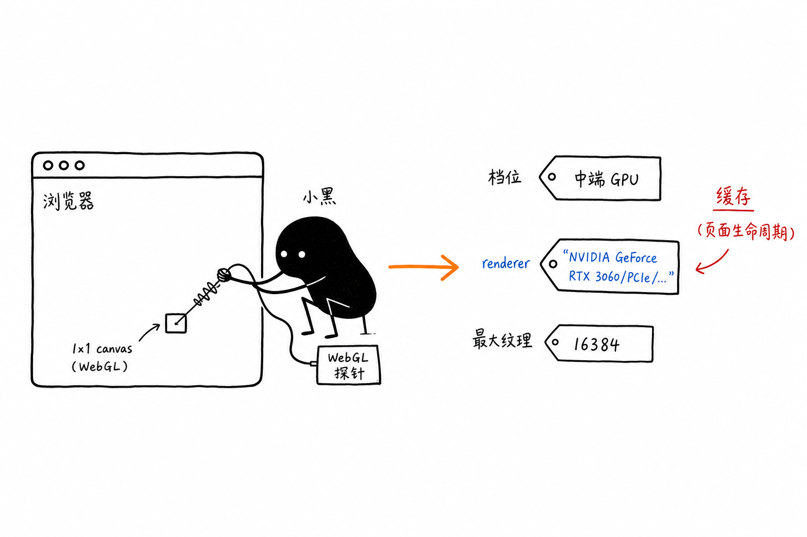
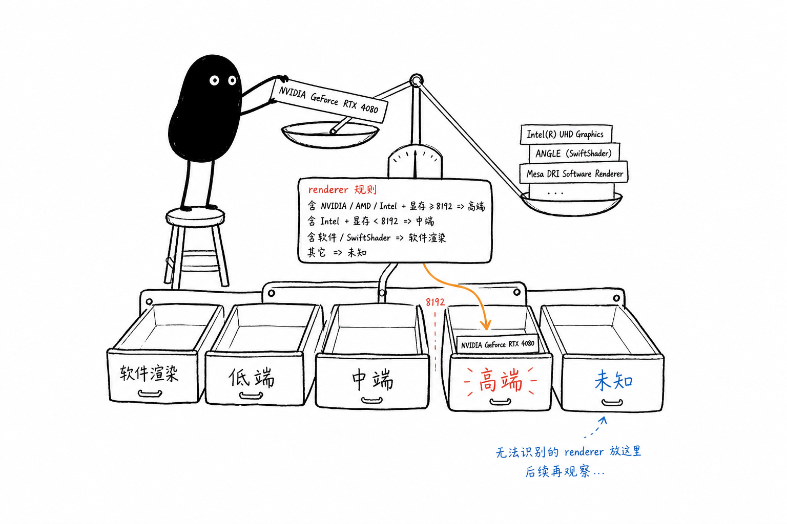

# gpu-detect

基于 WebGL 的浏览器 GPU 档位检测库，主要用于 webgl 的渲染性能优化降级判断。

在页面加载时读一次 WebGL 上下文，根据 `renderer` 名称与 `maxTextureSize` 做启发式分档，帮你决定该开高画质还是保守降载。

## 它能做什么

- 检测当前设备的 GPU 性能档位（`software` / `low` / `mid` / `high` / `unknown`）
- 读取 GPU 渲染器名称与最大纹理尺寸
- 提供 `isHighEndDevice()` 快捷判断
- 页面生命周期内缓存结果，重复调用零开销

## 在线演示

[https://z-juln.github.io/gpu-detect/](https://z-juln.github.io/gpu-detect/)

本地预览：

```bash
yarn preview:demo
```

## 安装

```bash
npm i gpu-detect
```

## 快速上手

```typescript
import { detectWebGLGpuInfo, isHighEndDevice, WebGLGpuTier } from 'gpu-detect'

const gpu = detectWebGLGpuInfo()
// {
//   tier: WebGLGpuTier.High,
//   renderer: 'ANGLE (Apple, ANGLE Metal Renderer: Apple M1, ...)',
//   maxTextureSize: 16384,
// }

if (gpu.tier === WebGLGpuTier.High) {
  // 启用高画质 WebGL 渲染
}

if (isHighEndDevice()) {
  // 等价于 gpu.tier === WebGLGpuTier.High
}
```

## 工作原理



1. 创建 1×1 canvas，优先用 `failIfMajorPerformanceCaveat: true` 获取 WebGL 上下文，排除性能陷阱
2. 通过 `WEBGL_debug_renderer_info` 读取 `UNMASKED_RENDERER_WEBGL` 与 `MAX_TEXTURE_SIZE`
3. 按 renderer 关键词与纹理尺寸阈值分档
4. 结果缓存在内存中；`clearWebGLGpuCache()` 可清除（主要用于测试）

SSR 或无 `document` 时返回 `unknown`；无法创建 WebGL 上下文时归入 `software`。

## 档位说明



| 档位 | 值 | 判定依据 | 建议策略 |
| --- | --- | --- | --- |
| **Software** | `'software'` | SwiftShader、LLVMpipe、mesa offscreen 等软件渲染；或无法创建 WebGL 上下文 | 重度降载或禁用 WebGL 特效 |
| **Low** | `'low'` | 老旧集显/移动 GPU（Intel HD、Mali-4、Adreno 3/4、PowerVR 等）；或 `maxTextureSize < 8192` | 保守降载 |
| **Mid** | `'mid'` | 有 renderer 但未命中 high/low 规则（如部分 Intel UHD 7/8、Mali-G5x、Adreno 5xx） | 介于 low 与 high 之间，偏保守 |
| **High** | `'high'` | Apple M 系列、NVIDIA、AMD、Intel Arc/Iris Xe、高端 Adreno 6/7、Mali-G7 等 | 可启用高画质 WebGL |
| **Unknown** | `'unknown'` | SSR 环境；或 WebGL 可用但浏览器未暴露 `WEBGL_debug_renderer_info` | 按保守策略处理 |

## API

| 导出 | 说明 |
| --- | --- |
| `detectWebGLGpuInfo()` | 检测 GPU 档位、渲染器名称、最大纹理尺寸（结果缓存） |
| `isHighEndDevice()` | `tier === WebGLGpuTier.High` 时返回 `true` |
| `clearWebGLGpuCache()` | 清除缓存，用于测试 |
| `WebGLGpuTier` | GPU 档位枚举 |
| `WebGLGpuInfo` | 检测结果类型 |

## WebGLGpuInfo 字段

| 字段 | 类型 | 说明 |
| --- | --- | --- |
| `tier` | `WebGLGpuTier` | 性能档位 |
| `renderer` | `string \| null` | GPU 渲染器名称；无法获取时为 `null` |
| `maxTextureSize` | `number \| null` | WebGL 支持的最大纹理边长（像素）；无法获取时为 `null` |

## 开发

```bash
yarn build          # 编译 TypeScript → dist/
yarn build:demo     # 打包 demo
yarn preview:demo   # 本地预览 demo
```
